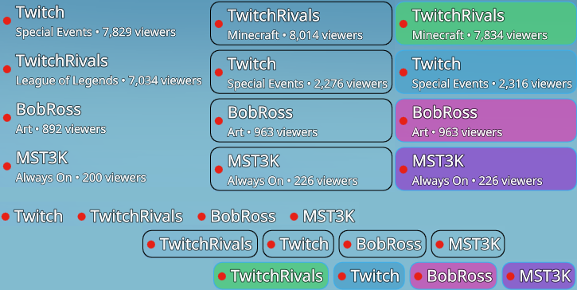

# Who's Live

A tiny KDE Plasma 6 desktop widget that shows which of your favourite **Twitch**
and **Kick** streamers are **live right now**. Click a name to open their
channel in your browser.

It's frameless and transparent, so it sits cleanly on your desktop — when
nobody's live it simply disappears.

It expands either **vertically** (a list) or **horizontally** (a slim strip):



---

## Features

- Watches any number of **Twitch and Kick** channels and shows who's currently
  live, merged into one list and sorted by viewers (each live dot is coloured
  by platform — Twitch red, Kick green)
- **Click a streamer's name** to open `twitch.tv/<channel>` or
  `kick.com/<channel>`
- Frameless and transparent — no window chrome, invisible when nobody is live
- Expand **horizontally** (a row) or **vertically** (a stack)
- Pin the text to any **edge or corner** of the widget (great for a slim strip
  along a screen edge)
- Adjustable **font face, size, and colour**
- Optional **border + translucent background** — around the whole widget and/or
  each streamer, with configurable width, square or rounded corners (adjustable
  radius), opacity, and a single colour, a gradient, or random colours
- Configurable check interval and a hover delay before the controls appear
- **Twitch**: sign in once with your own account — no setup, no API keys to
  manage
- **Kick**: connect with your own free Kick app (a one-time, guided setup —
  Kick requires this, see below)

---

## Requirements

- **KDE Plasma 6** (Wayland or X11)
- `kpackagetool6` — ships with Plasma (in `plasma-workspace`); used by the
  installer
- For Twitch: a Twitch account (used only to sign in)
- For Kick: a Kick account and a free Kick developer app you create once
  (guided in [First run](#first-run-connect-your-accounts) below)

You can use either platform on its own, or both together — set up only the
ones you want.

---

## Install

### From a release (recommended)

Download the latest `whos-live.plasmoid` and install it — no clone or build
needed:

```sh
curl -LO https://github.com/koconnorgit/kde-whos-live-widget/releases/latest/download/whos-live.plasmoid
kpackagetool6 --type Plasma/Applet --install whos-live.plasmoid
```

Already have an older version? Swap `--install` for `--upgrade`. You can also
just grab the file from the [Releases page](https://github.com/koconnorgit/kde-whos-live-widget/releases/latest)
in your browser, or install it from **Add Widgets… → Get New Widgets…** once
it's listed on the [KDE Store](https://www.opendesktop.org/p/2361661/).

### From source

```sh
git clone https://github.com/koconnorgit/kde-whos-live-widget.git
cd kde-whos-live-widget
./install.sh
```

To update later, `git pull` and run `./install.sh` again.

### Either way

**Right-click your desktop → Add Widgets…**, search for **Who's Live**, and
drag it onto your desktop. If it doesn't show up right away, restart the shell:

```sh
kquitapp6 plasmashell && kstart plasmashell
```

---

## First run: connect your accounts

Set up Twitch, Kick, or both. Then add channel names in the settings and the
widget shows who's live.

### Twitch (sign in once)

1. Click **Link Twitch account** on the widget.
2. Your browser opens a Twitch page — approve the request (you may need to log
   in to Twitch first). You can also go to `twitch.tv/activate` and type the
   code the widget shows.
3. That's it — the widget starts showing who's live.

The sign-in is **read-only**: it can only see public "who's live" information.
It can't post, change anything on your account, or read your messages. You can
revoke it any time at <https://www.twitch.tv/settings/connections>.

### Kick (connect your own app)

Twitch lets this widget ship a built-in app ID, so you just sign in. **Kick
doesn't** — its API requires a *client secret*, which can't be safely bundled
into an open-source widget. So on Kick you create your own free app once (it
takes a minute) and the widget uses it. This also means your Kick usage is
entirely your own — it isn't shared with anyone else running the widget.

Open the widget's settings (**right-click → Configure Who's Live…**), find the
**Kick** section, and:

1. Click **Open Kick developer settings** and sign in to Kick.
2. Create a new app. **Kick app names must be unique and contain no spaces**, so
   use the suggested name in settings (`kdewidget` plus a random suffix) or any
   unique name of your own. If it asks for a **Redirect URI**, enter
   `http://localhost`; the widget never uses it.
3. Copy the app's **Client ID** and **Client Secret** into the matching fields.
4. Click **Connect Kick account**.

The widget validates the credentials right away and starts checking your Kick
channels. The Client ID and Secret are stored locally on your computer (in your
Plasma config) and are used only to read public live-stream status — they can't
post or change anything on your account. **Disconnect Kick account** removes
them.

---

## Configure

Right-click the widget → **Configure Who's Live…**:

- **Twitch channels** / **Kick channels** — the streamers to watch on each
  platform, one per line. Use the name from the channel's URL (e.g. `shroud`),
  not the fancy display name. Twitch channels appear once you link your Twitch
  account; Kick channels need a connected Kick account.
- **Expand** — Horizontally or Vertically.
- **Horizontal / Vertical align** — pin the text to a side or corner.
- **Font face / size / colour** — match your desktop. Leave colour on the
  theme default to follow your Plasma colours.
- **Show controls after** — how long to hover before the refresh/settings
  buttons fade in (set to *Immediately* to always show them on hover).
- **Check every** — how often to refresh (default 60 s).
- **Widget border / background** and **Per-streamer border / background** — two
  independent, opt-in frames (one around the whole widget, one around each live
  streamer). Each has its own:
  - **Border** — width (0 = no line) and colour
  - **Corners** — Square or Rounded, with an adjustable radius
  - **Fill** — opacity, plus a **fill mode**:
    - *Single* — the first colour in the list
    - *Gradient* — blends all the colours in the list
    - *Random* — a colour per streamer, re-rolled whenever a channel newly comes
      online; drawn from your colour list, or a random hue if the list is empty
  - **Fill colours** — add/remove swatches for the list above
- **Account** — link or unlink Twitch.
- **Kick** — register and connect (or disconnect) your own Kick app, with the
  step-by-step instructions described in [First run](#kick-connect-your-own-app).

### Tip: a slim strip along a screen edge

Stretch the widget across the bottom of your screen, set **Expand: Horizontally**
and **Vertical align: Bottom**, and the live names will hug the bottom edge.
Desktop widgets have a minimum height in Plasma, but the alignment lets the text
sit exactly where you want regardless.

---

## Troubleshooting

- **Nothing shows / "Nobody's live"** — that's normal when none of your channels
  are streaming. Hover the widget to see the status and the refresh button.
- **Widget doesn't appear in "Add Widgets…"** — restart Plasma:
  `kquitapp6 plasmashell && kstart plasmashell`.
- **Stuck asking to sign in** — click **Link Twitch account** again; if your
  authorization expired, just re-approve in the browser.
- **Kick says "sign-in failed — check your Client ID and Secret"** — the
  credentials didn't match an app. Re-copy them from the Kick developer portal
  (watch for stray spaces), then **Connect Kick account** again. Make sure you
  copied the **Client Secret**, not the app's signing secret or any other value.
- **Kick channels don't appear** — confirm the Kick section shows *Connected*,
  and that you used the name from the channel URL (`kick.com/<name>`).
- **Can't find the widget when nobody's live** — it's transparent by design.
  Hover where you placed it (controls appear) or right-click that spot.

---

## Remove

```sh
./uninstall.sh
```

or `kpackagetool6 --type Plasma/Applet --remove io.github.koconnorgit.whoslive`,
then remove the widget from your desktop if it's still there.

---

## For developers / forking

Twitch requires every app to send a **Client ID**. This widget ships with one
embedded, so end users never deal with it. If you fork and publish your own
build, register your own app and swap the ID in:

1. Create an app at <https://dev.twitch.tv/console/apps>:
   - **OAuth Redirect URL**: `http://localhost`
   - **Client Type**: **Public** (no client secret is used or shipped)
2. Put its Client ID in `package/contents/ui/main.qml`:
   ```qml
   readonly property string embeddedClientId: "your_client_id_here"
   ```

Sign-in uses the OAuth **Device Code** flow, which lets a public client refresh
tokens without a secret — so nothing sensitive is ever stored in the repo or on
disk. Note that all installs of a given build share that app's Twitch API rate
limit.

**Kick is different.** Kick's API requires a **client secret** even for
read-only public data, and there's no device-code flow — so there's no safe way
to embed a shared app the way Twitch's public Client ID is embedded. Instead,
each user registers their own app at <https://kick.com/settings/developer> and enters its
**Client ID + Client Secret** in settings. The widget then uses the OAuth 2.1
**client-credentials** grant to mint a short-lived *app access token* (no
refresh token — it's simply re-requested on expiry) and reads public live
status from `GET https://api.kick.com/public/v1/channels?slug=…` (up to 50
channels per request). Because every user brings their own app, Kick rate
limits and revocations are per-user, never shared. The Client Secret is stored
in the user's local Plasma config — it is never committed to the repo.

Project layout:

```
package/
  metadata.json                 widget manifest
  contents/
    config/main.xml             settings schema
    config/config.qml           settings categories
    ui/configGeneral.qml        settings form
    ui/FrameSettings.qml        reusable border/background settings group
    ui/main.qml                 the widget + Twitch/Kick logic
install.sh / uninstall.sh       per-user (un)installers
```

---

## License

MIT — see [LICENSE](LICENSE).
