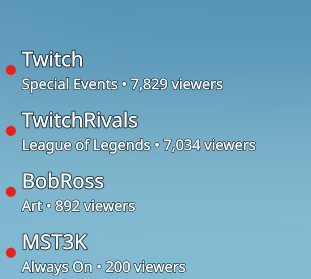

# Twitch Live

A tiny KDE Plasma 6 desktop widget that shows which of your favourite Twitch
streamers are **live right now**. Click a name to open their channel in your
browser.

It's frameless and transparent, so it sits cleanly on your desktop — when
nobody's live it simply disappears.

**Vertical layout** — a list that expands downward:



**Horizontal layout** — a slim strip, e.g. along a screen edge:


---

## Features

- Watches any number of Twitch channels and shows who's currently live
- **Click a streamer's name** to open `twitch.tv/<channel>`
- Frameless and transparent — no window chrome, invisible when nobody is live
- Expand **horizontally** (a row) or **vertically** (a stack)
- Pin the text to any **edge or corner** of the widget (great for a slim strip
  along a screen edge)
- Adjustable **font face, size, and colour**
- Configurable check interval and a hover delay before the controls appear
- Sign in once with your own Twitch account — no setup, no API keys to manage

---

## Requirements

- **KDE Plasma 6** (Wayland or X11)
- `kpackagetool6` — ships with Plasma (in `plasma-workspace`); used by the
  installer
- A Twitch account (used only to sign in)

---

## Install

```sh
git clone https://github.com/koconnorgit/kde-twitch-live-widget.git
cd kde-twitch-live-widget
./install.sh
```

Then **right-click your desktop → Add Widgets…**, search for **Twitch Live**,
and drag it onto your desktop. If it doesn't show up right away, restart the
shell:

```sh
kquitapp6 plasmashell && kstart plasmashell
```

To update later, `git pull` and run `./install.sh` again.

---

## First run: sign in

1. Click **Link Twitch account** on the widget.
2. Your browser opens a Twitch page — approve the request (you may need to log
   in to Twitch first). You can also go to `twitch.tv/activate` and type the
   code the widget shows.
3. That's it — the widget starts showing who's live.

The sign-in is **read-only**: it can only see public "who's live" information.
It can't post, change anything on your account, or read your messages. You can
revoke it any time at <https://www.twitch.tv/settings/connections>.

---

## Configure

Right-click the widget → **Configure Twitch Live…**:

- **Channels** — the streamers to watch, one per line. Use the name from the
  channel's URL (e.g. `shroud`), not the fancy display name.
- **Expand** — Horizontally or Vertically.
- **Horizontal / Vertical align** — pin the text to a side or corner.
- **Font face / size / colour** — match your desktop. Leave colour on the
  theme default to follow your Plasma colours.
- **Show controls after** — how long to hover before the refresh/settings
  buttons fade in (set to *Immediately* to always show them on hover).
- **Check every** — how often to refresh (default 60 s).
- **Account** — sign in or sign out of Twitch.

### Tip: a slim strip along a screen edge

Stretch the widget across the bottom of your screen, set **Expand: Horizontally**
and **Vertical align: Bottom**, and the live names will hug the bottom edge.
Desktop widgets have a minimum height in Plasma, but the alignment lets the text
sit exactly where you want regardless.

---

## Troubleshooting

- **Nothing shows / "Nobody's live"** — that's normal when none of your channels
  are streaming. Hover the widget to see the status and the refresh button.
- **Widget doesn't appear in "Add Widgets…"** — restart Plasma:
  `kquitapp6 plasmashell && kstart plasmashell`.
- **Stuck asking to sign in** — click **Link Twitch account** again; if your
  authorization expired, just re-approve in the browser.
- **Can't find the widget when nobody's live** — it's transparent by design.
  Hover where you placed it (controls appear) or right-click that spot.

---

## Remove

```sh
./uninstall.sh
```

or `kpackagetool6 --type Plasma/Applet --remove io.github.koconnorgit.twitchlive`,
then remove the widget from your desktop if it's still there.

---

## For developers / forking

Twitch requires every app to send a **Client ID**. This widget ships with one
embedded, so end users never deal with it. If you fork and publish your own
build, register your own app and swap the ID in:

1. Create an app at <https://dev.twitch.tv/console/apps>:
   - **OAuth Redirect URL**: `http://localhost`
   - **Client Type**: **Public** (no client secret is used or shipped)
2. Put its Client ID in `package/contents/ui/main.qml`:
   ```qml
   readonly property string embeddedClientId: "your_client_id_here"
   ```

Sign-in uses the OAuth **Device Code** flow, which lets a public client refresh
tokens without a secret — so nothing sensitive is ever stored in the repo or on
disk. Note that all installs of a given build share that app's Twitch API rate
limit.

Project layout:

```
package/
  metadata.json                 widget manifest
  contents/
    config/main.xml             settings schema
    config/config.qml           settings categories
    ui/configGeneral.qml        settings form
    ui/main.qml                 the widget + Twitch logic
install.sh / uninstall.sh       per-user (un)installers
```

---

## License

MIT — see [LICENSE](LICENSE).
